### 介绍
Apollo（阿波罗）是携程框架部门研发的分布式配置中心，能够集中化管理应用不同环境、不同集群的配置，配置修改后能够实时推送到应用端，并且具备规范的权限、流程治理等特性，适用于微服务配置管理场景。
[github地址](https://github.com/zhaops-hub/apollo)  

直接搭建多环境Apollo  

Apollo目前支持以下环境：
- DEV: 开发环境
- FAT：测试环境，相当于alpha环境(功能测试)
- UAT：集成环境，相当于beta环境（回归测试）
- PRO：生产环境  


如果希望添加自定义的环境名称，[具体步骤可以参考](https://github.com/ctripcorp/apollo/wiki/%E9%83%A8%E7%BD%B2&%E5%BC%80%E5%8F%91%E9%81%87%E5%88%B0%E7%9A%84%E5%B8%B8%E8%A7%81%E9%97%AE%E9%A2%98#42-%E6%B7%BB%E5%8A%A0%E8%87%AA%E5%AE%9A%E4%B9%89%E7%9A%84%E7%8E%AF%E5%A2%83)

**本次部署 dev pro 两套环境**


IP | 部署 | 
---|---
172.16.100.222 | dev环境，mysql，包含管理页面 portal
172.16.100.101 | pro环境


## 部署
本次部署是用docker部署  
因为官方没有提供现成的镜像，但是提供了DockerFile ，需要自己打包

### 下载源码自己编译，或者直接去github上去下载Release包

```
// 下载源码
$ git clone https://github.com/ctripcorp/apollo.git
```

结构如下  

- apollo-portal: 这个是管理页面
- apollo-adminservice: apollo 服务端，相当于后台服务
- apollo-configservice: apollo 注册中心

一套环境（apollo-adminservice，apollo-configservice）两个服务，apollo-portal只部署一个就可以，可以配置多个环境进行管理

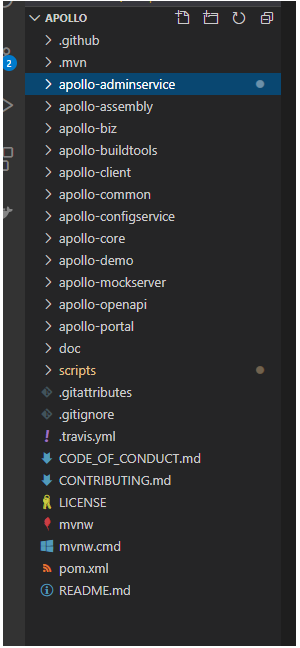

编译代码（必须先装jdk 和 Maven ）  
windows 直接双击 build.bat   
linux build.sh
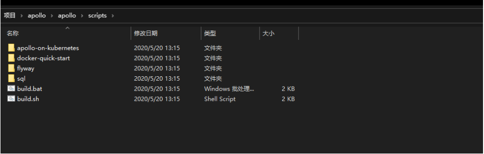

编译完的截图

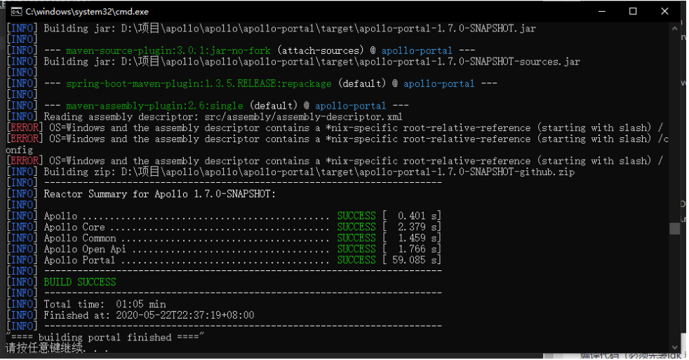


#### 配置数据库

Apollo服务端共需要两个数据库：ApolloPortalDB和ApolloConfigDB，我们把数据库、表的创建和样例数据都分别准备了sql文件，只需要导入数据库即可。  

需要注意的是ApolloPortalDB只需要在生产环境部署一个即可，而ApolloConfigDB需要在每个环境部署一套，如fat、uat和pro分别部署3套ApolloConfigDB。

脚本在源码里面   

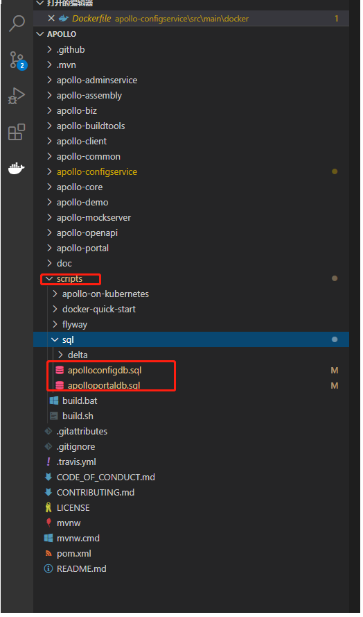

命令行进入到mysql里面，source apolloportaldb.sql source ApolloPortalDB.sql ，或者直接navicat导入  

 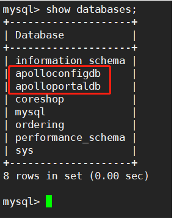


#### 打包镜像 apollo-configservice

```
# 先打包镜像，先找到源码里面的DockerFile
# apollo-configservice > src > main > docker > DockerFile

# Dockerfile for apollo-configservice
# 1. Copy apollo-configservice-${VERSION}-github.zip to current directory
# 2. Build with: docker build -t apollo-configservice .
# 3. Run with: docker run -p 8080:8080 -e DS_URL="jdbc:mysql://fill-in-the-correct-server:3306/ApolloConfigDB?characterEncoding=utf8" -e DS_USERNAME=FillInCorrectUser -e DS_PASSWORD=FillInCorrectPassword -d -v /tmp/logs:/opt/logs --name apollo-configservice apollo-configservice

FROM openjdk:8-jre-alpine
MAINTAINER ameizi <sxyx2008@163.com>

ENV VERSION 1.7.0-SNAPSHOT
ENV SERVER_PORT 8080
# DataSource Info
ENV DS_URL ""
ENV DS_USERNAME ""
ENV DS_PASSWORD ""

RUN echo "http://mirrors.aliyun.com/alpine/v3.8/main" > /etc/apk/repositories \
    && echo "http://mirrors.aliyun.com/alpine/v3.8/community" >> /etc/apk/repositories \
    && apk update upgrade \
    && apk add --no-cache procps unzip curl bash tzdata \
    && ln -sf /usr/share/zoneinfo/Asia/Shanghai /etc/localtime \
    && echo "Asia/Shanghai" > /etc/timezone

ADD apollo-configservice-${VERSION}-github.zip /apollo-configservice/apollo-configservice-${VERSION}-github.zip

RUN unzip /apollo-configservice/apollo-configservice-${VERSION}-github.zip -d /apollo-configservice \
    && rm -rf /apollo-configservice/apollo-configservice-${VERSION}-github.zip \
    && sed -i '$d' /apollo-configservice/scripts/startup.sh \
    && chmod +x /apollo-configservice/scripts/startup.sh \
    && echo "tail -f /dev/null" >> /apollo-configservice/scripts/startup.sh

EXPOSE $SERVER_PORT

CMD ["/apollo-configservice/scripts/startup.sh"]


# 找到编译好的 apollo-configservice-1.7.0-SNAPSHOT-github.zip 包 ，根据它上面的dockerfile注释，把zip包放到当前目录，就可以打包了


# apollo-configservice > target > apollo-configservice-1.7.0-SNAPSHOT-github.zip


```
 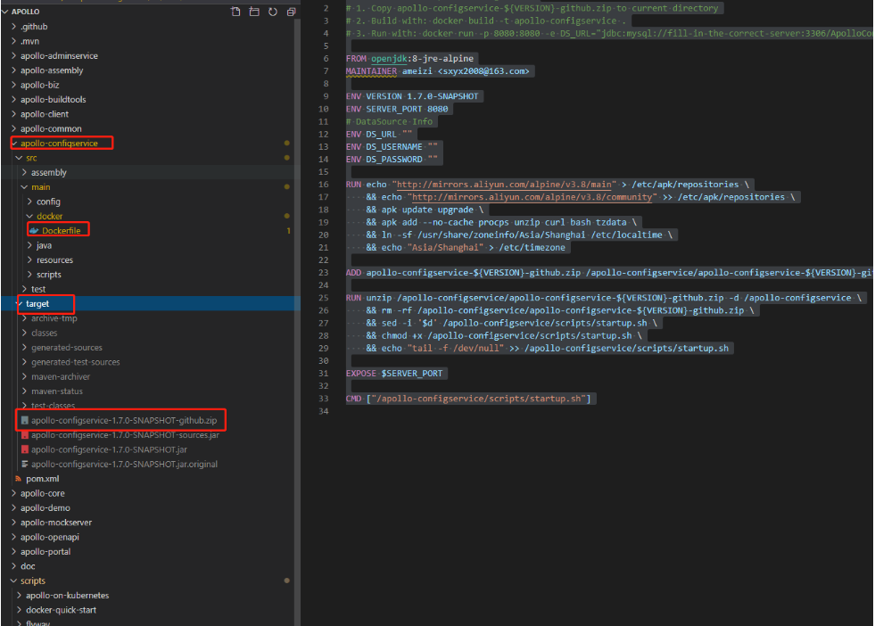


 把 dockerfile 和 zip包传到服务上 docker build


```
[root@localhost configservice]# ls
apollo-configservice-1.7.0-SNAPSHOT-github.zip  Dockerfile
[root@localhost configservice]#  docker build -t apollo-configservice .

# 打包镜像依赖基础镜像 openjdk:8-jre-alpine，如果有网络会自动下载，内网的可以直接导入

```


#### 打包镜像 apollo-adminservice 

```
# 先打包镜像，先找到源码里面的DockerFile
# apollo-adminservice > src > main > docker > DockerFile

# Dockerfile for apollo-adminservice
# 1. Copy apollo-adminservice-${VERSION}-github.zip to current directory
# 2. Build with: docker build -t apollo-adminservice .
# 3. Run with: docker run -p 8090:8090 -e DS_URL="jdbc:mysql://fill-in-the-correct-server:3306/ApolloConfigDB?characterEncoding=utf8" -e DS_USERNAME=FillInCorrectUser -e DS_PASSWORD=FillInCorrectPassword -d -v /tmp/logs:/opt/logs --name apollo-adminservice apollo-adminservice

FROM openjdk:8-jre-alpine
MAINTAINER ameizi <sxyx2008@163.com>

ENV VERSION 1.7.0-SNAPSHOT
ENV SERVER_PORT 8090
# DataSource Info
ENV DS_URL ""
ENV DS_USERNAME ""
ENV DS_PASSWORD ""

RUN echo "http://mirrors.aliyun.com/alpine/v3.8/main" > /etc/apk/repositories \
    && echo "http://mirrors.aliyun.com/alpine/v3.8/community" >> /etc/apk/repositories \
    && apk update upgrade \
    && apk add --no-cache procps unzip curl bash tzdata \
    && ln -sf /usr/share/zoneinfo/Asia/Shanghai /etc/localtime \
    && echo "Asia/Shanghai" > /etc/timezone

ADD apollo-adminservice-${VERSION}-github.zip /apollo-adminservice/apollo-adminservice-${VERSION}-github.zip

RUN unzip /apollo-adminservice/apollo-adminservice-${VERSION}-github.zip -d /apollo-adminservice \
    && rm -rf /apollo-adminservice/apollo-adminservice-${VERSION}-github.zip \
    && sed -i '$d' /apollo-adminservice/scripts/startup.sh \
    && chmod +x /apollo-adminservice/scripts/startup.sh \
    && echo "tail -f /dev/null" >> /apollo-adminservice/scripts/startup.sh

EXPOSE $SERVER_PORT

CMD ["/apollo-adminservice/scripts/startup.sh"]


# 找到编译好的 apollo-adminservice-1.7.0-SNAPSHOT-github.zip 包 ，根据它上面的dockerfile注释，把zip包放到当前目录，就可以打包了


# apollo-adminservice > target > apollo-adminservice-1.7.0-SNAPSHOT-github.zip


# 把 dockerfile 和 zip包传到服务上 docker build

[root@localhost adminservice]# ls
apollo-adminservice-1.7.0-SNAPSHOT-github.zip  Dockerfile
[root@localhost adminservice]#  docker build -t apollo-adminservice .

```

#### 打包镜像 apollo-portal

```
# 先打包镜像，先找到源码里面的DockerFile
# apollo-portal > src > main > docker > DockerFile

# Dockerfile for apollo-portal
# 1. Copy apollo-portal-${VERSION}-github.zip to current directory
# 2. Build with: docker build -t apollo-portal .
# 3. Run with: docker run -p 8070:8070 -e DS_URL="jdbc:mysql://fill-in-the-correct-server:3306/ApolloPortalDB?characterEncoding=utf8" -e DS_USERNAME=FillInCorrectUser -e DS_PASSWORD=FillInCorrectPassword -e DEV_META=http://fill-in-dev-meta-server:8080 -e PRO_META=http://fill-in-pro-meta-server:8080 -d -v /tmp/logs:/opt/logs --name apollo-portal apollo-portal

FROM openjdk:8-jre-alpine
MAINTAINER ameizi <sxyx2008@163.com>

ENV VERSION 1.7.0-SNAPSHOT
ENV SERVER_PORT 8070
# DataSource Info 
ENV DS_URL ""
ENV DS_USERNAME ""
ENV DS_PASSWORD ""
# Environmental variable declaration (meta server url, different environments should have different meta server addresses)
ENV DEV_META ""
ENV FAT_META ""
ENV UAT_META ""
ENV LPT_META ""
ENV PRO_META ""

RUN echo "http://mirrors.aliyun.com/alpine/v3.8/main" > /etc/apk/repositories \
    && echo "http://mirrors.aliyun.com/alpine/v3.8/community" >> /etc/apk/repositories \
    && apk update upgrade \
    && apk add --no-cache procps unzip curl bash tzdata \
    && ln -sf /usr/share/zoneinfo/Asia/Shanghai /etc/localtime \
    && echo "Asia/Shanghai" > /etc/timezone

ADD apollo-portal-${VERSION}-github.zip /apollo-portal/apollo-portal-${VERSION}-github.zip

RUN unzip /apollo-portal/apollo-portal-${VERSION}-github.zip -d /apollo-portal \
    && rm -rf /apollo-portal/apollo-portal-${VERSION}-github.zip \
    && sed -i '$d' /apollo-portal/scripts/startup.sh \
    && chmod +x /apollo-portal/scripts/startup.sh \
    && echo "tail -f /dev/null" >> /apollo-portal/scripts/startup.sh

EXPOSE $SERVER_PORT

CMD ["/apollo-portal/scripts/startup.sh"]


# 找到编译好的 apollo-adminservice-1.7.0-SNAPSHOT-github.zip 包 ，根据它上面的dockerfile注释，把zip包放到当前目录，就可以打包了


# apollo-portal > target > apollo-portal-1.7.0-SNAPSHOT-github.zip


# 把 dockerfile 和 zip包传到服务上 docker build

[root@localhost portal]# ls
apollo-portal-1.7.0-SNAPSHOT-github.zip  Dockerfile
[root@localhost portal]# docker build -t apollo-portal .

```

### 开始部署
都打完镜像查看一下 

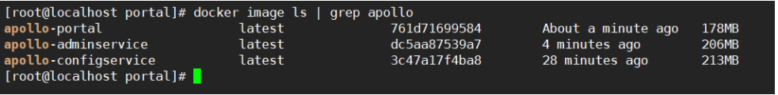


#### 编写docker-compose.yml

利用docker-compose 服务编排，比较省事

**apollo.yml**

包含 adminservice,configservice

```
version: '3'
services:
  apollo-configservice:
    container_name: configservice
    image: apollo-configservice:latest # 镜像地址，这里使用的是直接在当前主机上构建的镜像
    # ports:
    #   - "8080:8080"
    network_mode: host 
    volumes:
      # 日志挂载
      - /usr/local/apollo/servers/server2/logs/apollo-configservice:/opt/logs
    environment:
      # 可通过 SERVER_PORT 指定默认启动端口，ports 也需要对应修改
      # SERVER_PORT: 8080
      # 指定 homePageUrl 为当前宿主的 apollo-configservice 地址，不然会出现无法访问
      # JAVA_OPTS: "-Deureka.instance.homePageUrl=http://172.16.100.6:8080"
      # 数据库连接地址
      DS_URL: "jdbc:mysql://172.16.100.6:3306/ApolloConfigDB?characterEncoding=utf8"
      # 数据库用户名
      DS_USERNAME: "root"
      # 数据库密码 
      DS_PASSWORD: "abc123"
      # 服务器的端口
      SERVER_PORT: 8080
      
  apollo-adminservice:
    container_name: adminservice
    image: apollo-adminservice:latest # 镜像地址，这里使用的是直接在当前主机上构建的镜像
    # ports:
    #   - "8090:8090"
    network_mode: host 
    volumes:
      # 日志挂载
      - /usr/local/apollo/servers/server2/logs/apollo-adminservice:/opt/logs
    environment:
      # 指定 homePageUrl 为当前宿主的 apollo-adminservice 地址，不然会出现无法访问
      # JAVA_OPTS: "-Deureka.instance.homePageUrl=http://172.16.100.6:8090"
      # 数据库连接地址
      DS_URL: "jdbc:mysql://172.16.100.6:3306/ApolloConfigDB?characterEncoding=utf8"
      # 数据库用户名
      DS_USERNAME: "root"
      # 数据库密码 
      DS_PASSWORD: "abc123"
      # 服务器的端口
      SERVER_PORT: 8090
    depends_on:
      - apollo-configservice
```

启动容器


```
[root@localhost apollo]# docker-compose -f apollo.yml up -d
```

测试一下

http://192.168.179.130:8080/ 访问8080页面查看注册情况 

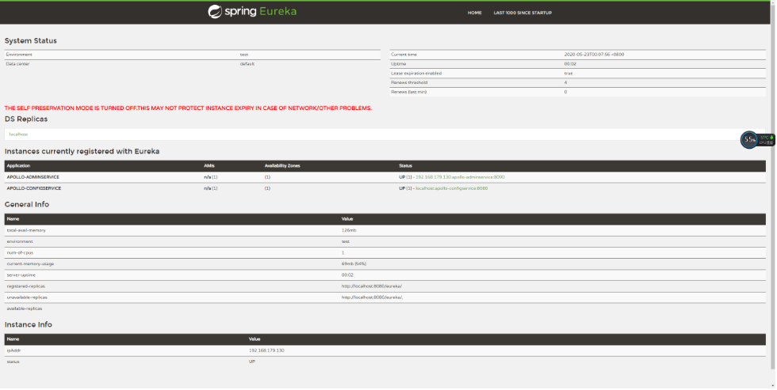


**portal.yml**


```
version: '3'
services:
  apollo-portal:
    image: apollo-portal:latest # 镜像地址，这里使用的是直接在当前主机上构建的镜像
    container_name: apollo-portal
    ports:
      - "8070:8070"
    volumes:
      # 日志挂载
      - /usr/local/apollo/servers/server1/logs/apollo-portal:/opt/logs  
    environment:
      # 数据库连接地址
      DS_URL: "jdbc:mysql://172.16.100.6:3306/ApolloPortalDB?characterEncoding=utf8" 
      # 数据库用户名
      DS_USERNAME: "root"
      # 数据库密码      
      DS_PASSWORD: "abc123"
      # META_SERVER 地址，如 http://192.168.100.234:8080,http://192.168.100.234:8081（多个可用,分隔，建议使用 LB 域名）,
      DEV_META: "http://172.16.100.6:8080"
      PRO_META: "http://172.16.100.6:8080"
```

启动容器


```
[root@localhost apollo]# docker-compose -f apollo-portal.yml up -d
```

测试一下

http://192.168.179.130:8070 账号密码：apollo,admin 

查看系统信息

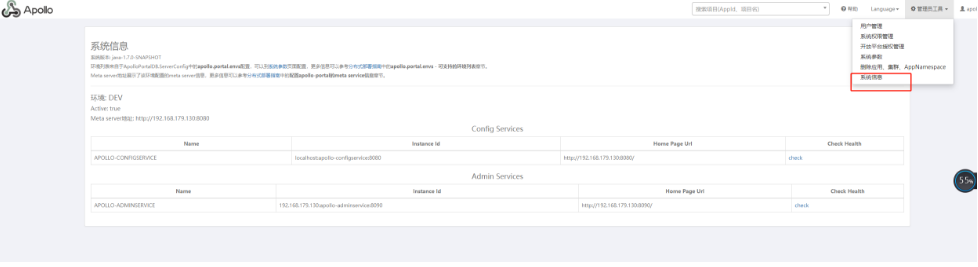


### 部署多环境
PRO 生产环境  

其实多环境其实很简单，就是再多部署一个（adminservice,configservice），portal 就部署一套就可以，可以管理多套环境，注意数据库是一个环境一个数据库


生产环境只需要安装 adminservice 和 configservice  

#### 配置数据库  
生一个 ApolloConfigDBPRO 数据库

进入mysql命令行 source ApolloConfigDBPRO.sql

 


直接把docker-compose.yml 脚本拿来


```

version: '3'
services:
  apollo-configservice:
    container_name: configservice
    image: apollo-configservice:latest # 镜像地址，这里使用的是直接在当前主机上构建的镜像
    #ports:
    #  - "8080:8080"
    network_mode: host
    volumes:
      # 日志挂载
      - /usr/local/apollo/servers/server2/logs/apollo-configservice:/opt/logs
    environment:
      # 可通过 SERVER_PORT 指定默认启动端口，ports 也需要对应修改
      # SERVER_PORT: 8080
      # 指定 homePageUrl 为当前宿主的 apollo-configservice 地址，不然会出现无法访问
      # JAVA_OPTS: "-Deureka.instance.homePageUrl=http://172.16.100.6:8080"
      # 数据库连接地址
      DS_URL: "jdbc:mysql://172.16.100.6:3306/ApolloConfigDBPRO?characterEncoding=utf8"
      # 数据库用户名
      DS_USERNAME: "root"
      # 数据库密码 
      DS_PASSWORD: "abc123"
      SERVER_IP: "172.16.100.6"

  apollo-adminservice:
    container_name: adminservice
    image: apollo-adminservice:latest # 镜像地址，这里使用的是直接在当前主机上构建的镜像
    # ports:
    #   - "8090:8090"
    network_mode: host # 网络模式
    volumes:
      # 日志挂载
      - /usr/local/apollo/servers/server2/logs/apollo-adminservice:/opt/logs
    environment:
      # 指定 homePageUrl 为当前宿主的 apollo-adminservice 地址，不然会出现无法访问
      # JAVA_OPTS: "-Deureka.instance.homePageUrl=http://172.16.100.6:8090"
      # 数据库连接地址
      DS_URL: "jdbc:mysql://172.16.100.6:3306/ApolloConfigDBPRO?characterEncoding=utf8"
      # 数据库用户名
      DS_USERNAME: "root"
      # 数据库密码 
      DS_PASSWORD: "abc123"
      SERVER_PORT: 8090
    depends_on:
      - apollo-configservice
```


启动容器


```
[root@localhost apollo]# docker-compose -f apollo.yml up -d
```


测试一下

http://172.16.100.101:8080/ 访问8080页面查看注册情况  

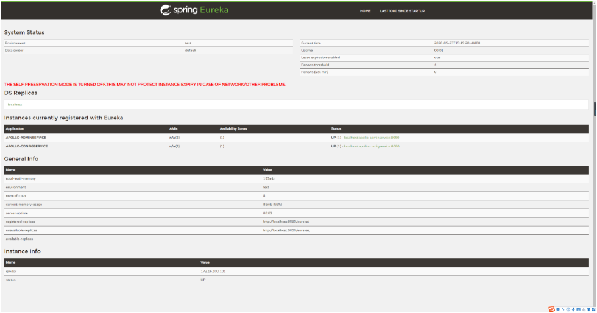


### protal 管理页面配置多集群

- 找到 apolloportaldb.serverconfig :
    -  apollo.portal.envs: dev,pro
    -  configView.memberOnly.envs: dev,pro


正在环境变量 PRO_META，PRO_META是生产环境对应的变量,直接在docker-compose.yml 配置文件中修改


```
version: '3'
services:
  apollo-portal:
    image: apollo-portal:latest # 镜像地址，这里使用的是直接在当前主机上构建的镜像
    container_name: apollo-portal
    ports:
      - "8070:8070"
    volumes:
      # 日志挂载
      - /usr/local/apollo/logs/apollo-portal:/opt/logs
    environment:
      # 数据库连接地址
      DS_URL: "jdbc:mysql://172.16.100.222:3306/ApolloPortalDB?characterEncoding=utf8"
      # 数据库用户名
      DS_USERNAME: "root"
      # 数据库密码      
      DS_PASSWORD: "abc123"
      # META_SERVER 地址，如 http://192.168.100.234:8080,http://192.168.100.234:8081（多个可用,分隔，建议使用 LB 域名）,
      DEV_META: "http://172.16.100.222:8080"
      PRO_META: "http://172.16.100.101:8080"

```


重启portal 容器


```
docker-compose -f apollo-portal.yml restart

```

查看系统信息

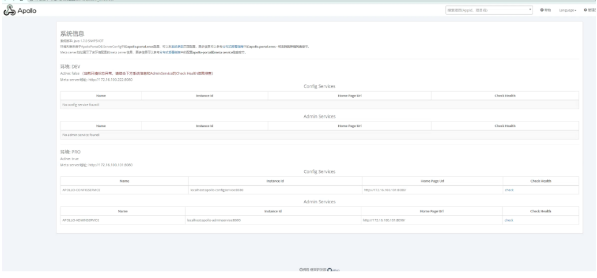

**如果在docker-compose.yml 配置文件里面配置的环境变量不起作用的话**  
**首先进入到容器里面查看一下 echo $PRO_META**  
**如果输出是空的话，那就是得先把容器卸载再起来，restart 不起作用的。**    
**这个一定要注意**  