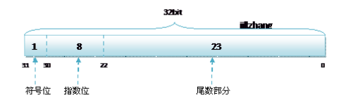

### IEEE 754 浮点数存储标准

规定浮点数格式如下：

s表示符号位，当s=0，V为正数；当s=1，V为负数

E表示8位阶码，采用移位存储

M表示23位尾数，如M为10100....，那么M所代表的二进制浮点数为M'=1+1/2+1/2^2=1.75，2>M'>=1

根据32位数计算为十进制：V=(−1)^s × M' × 2^(E−127)，

### 移位存储详解

如果采用传统的高bit表示正负的方法，将-127-127分为两个区间表示：

第一个区间：0 000000 0~ 0 111111 1 即 +0 到 127

第二个区间：1 000000 0~ 1 111111 1 即 -0 到 -127

很明显存在+0和-0的问题，如果采用移位存储技术，即在原始数值的基础上加 127，全部转换为>=0的数进行表示：

此时最高位不是符号位，8bit可以表示0~255，那么原始数值可以表示-127~128，分别如下

第一个区间：0 000000 0~ 0 111111 1 ，直接大小0~127 ，减去127后表达范围 -127 到 0

第二个区间：1 000000 0~ 1 111111 1 ，直接大小128~255，减去127后表达范围 1 到 128

也就是可以使用 8位二进制来表示从 -127~128 共计 127个负数+零（0）+128个正数总共 256个数，且使用移位存储即没有+0和-0的问题，又充分的使用这个新生成的 8位二进制数来最大限度的表示单精度浮点数的幂指数（阶码）

-----

如果不用以为存储，有 正0 负0 的问题

自己搞几个例子

0: `0 + 127 = 127`   `0 000000 0 + 0 111111 1 = 0 111111 1`

1: `1 + 127 = 128`  `0 000000 1 + 0 111111 1 = 1 000000 0`

2: `2 + 127 = 129`   `0 000001 0 + 111111 1 = 1 000000 1`

-1: `-1 + 127 = 126, 127 - 1`  `0 111111 1 - 0 000000 1 = 0 111111 0` 