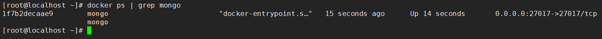
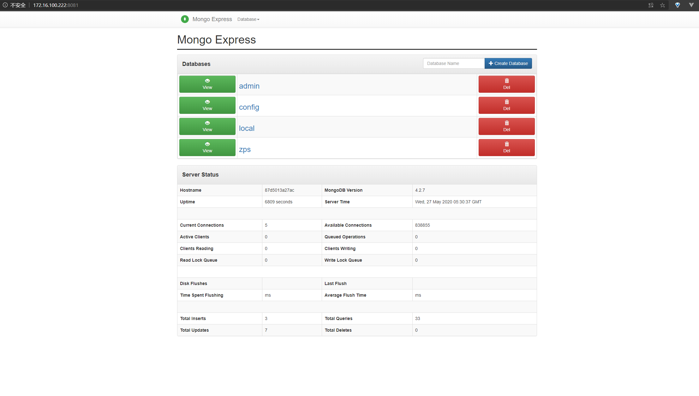

## MongoDB Docker 镜像安装

MongoDB 提供官方镜像，下载安装镜像方法如下：

```shell
# 获取mongo镜像
docker pull mongo
# 获取管理页面镜像
docker pull mongo-express
```


##  MongoDB 容器创建

### mongoDB

```shell
docker run --name mongo -p 27017:27017 -v /opt/mongodb/:/data/db -e MONGO_INITDB_ROOT_USERNAME=admin -e MONGO_INITDB_ROOT_PASSWORD=abc123 -d mongo
```

`-p` 指定容器的端口映射，mongodb 默认端口为 27017

`-v` 为设置容器的挂载目录，这里是将/opt/mongodb/即本机中的目录挂载到容器中的/data/db中，作为 mongodb 的存储目录

`MONGO_INITDB_ROOT_USERNAME` 环境变量，root用户名

`MONGO_INITDB_ROOT_PASSWORD` 环境变量，root密码

`--name` 为设置该容器的名称

`-d` 设置容器以守护进程方式运行



### mongo-express

```shell
docker run --name mongo-express --link mongo  -d -p 8081:8081 -e ME_CONFIG_OPTIONS_EDITORTHEME="3024-night" -e ME_CONFIG_BASICAUTH_USERNAME="mongoexpress" -e ME_CONFIG_BASICAUTH_PASSWORD="mongoexpress" -e ME_CONFIG_MONGODB_ADMINUSERNAME="admin" -e ME_CONFIG_MONGODB_ADMINPASSWORD="abc123"  mongo-express
```


## docker-compose

```yaml
# docker-compose.yaml
version: '3'
services:
  mongo:
    image: mongo:latest
    container_name: mongo
    ports:
      - "27017:27017"
    restart: always
    environment:
      - MONGO_INITDB_ROOT_USERNAME=root
      - MONGO_INITDB_ROOT_PASSWORD=abc123
    volumes:
      - ./data:/data/db
      - /usr/share/zoneinfo/Asia/Shanghai:/etc/localtime:ro 
    logging:
      driver: "journald"
  mongo-express:
    image: mongo-express:latest
    container_name: mongo-express
    links:
      - mongo
    restart: always
    ports:
      - "8081:8081"
    environment:
      - ME_CONFIG_OPTIONS_EDITORTHEME=3024-night
      - ME_CONFIG_BASICAUTH_USERNAME=root
      - ME_CONFIG_BASICAUTH_PASSWORD=abc123
      - ME_CONFIG_MONGODB_ADMINUSERNAME=root
      - ME_CONFIG_MONGODB_ADMINPASSWORD=abc123
    logging:
      driver: "journald"   
```


```shell
docker-compose -f mongo.yml up -d
```


**如果发现密码登录失败，请确认安装之前 宿主机的映射目录里面是空的  /opt/mongodb**



