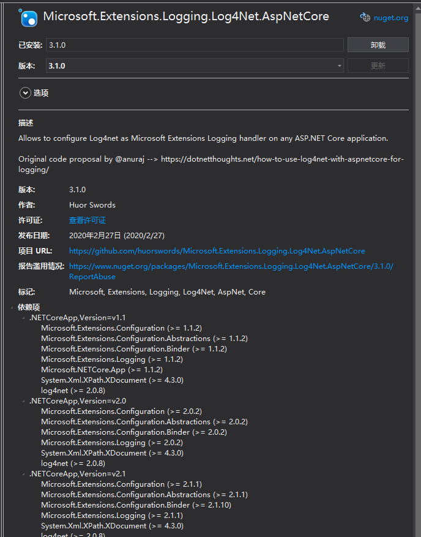
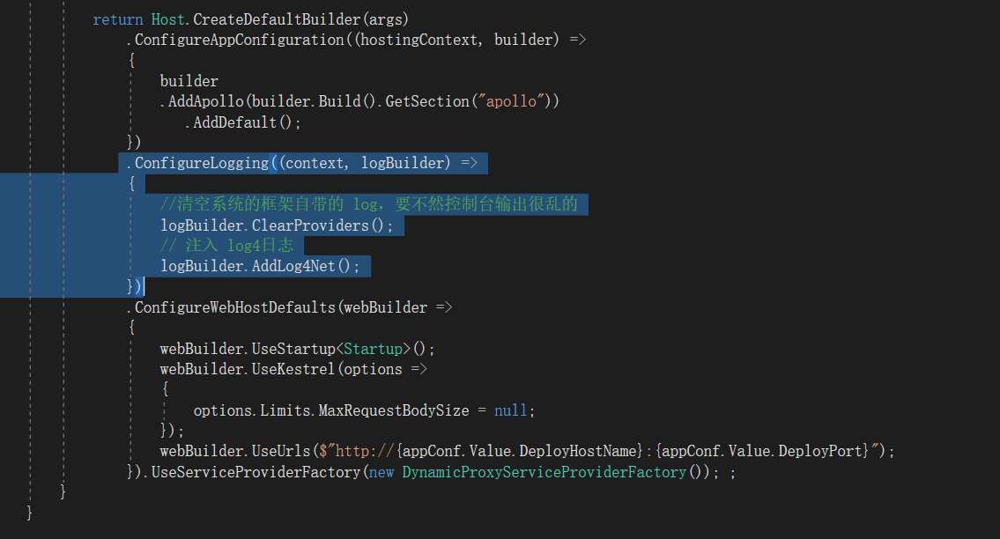
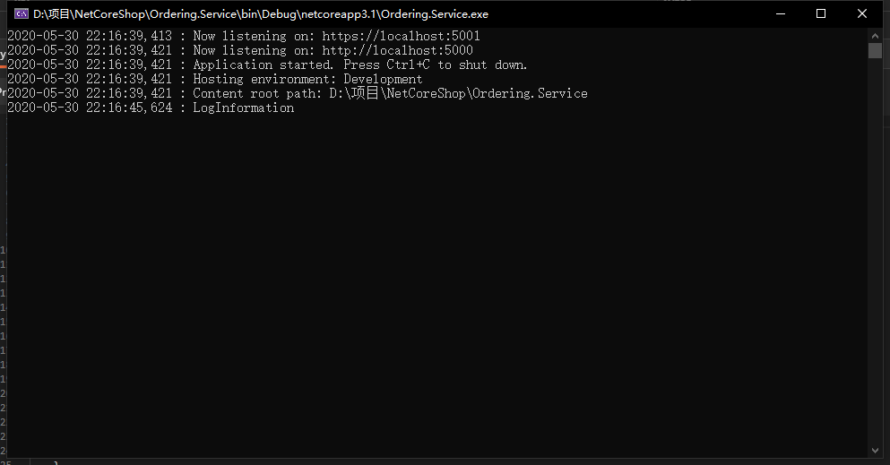
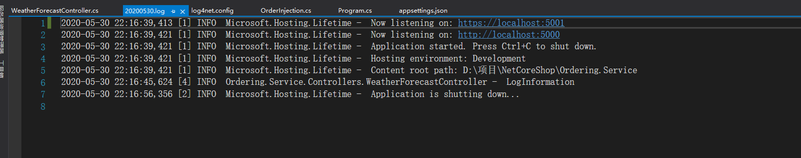

## 添加NuGet包

Microsoft.Extensions.Logging.Log4Net.AspNetCore




## Program 注入netcore

```c#
 .ConfigureLogging((context, logBuilder) =>
                {
                    //清空系统的框架自带的 log，要不然控制台输出很乱的
                    logBuilder.ClearProviders();
                    // 注入 log4日志
                    logBuilder.AddLog4Net();
                })
```



`logBuilder.ClearProviders();` ：这个是清楚netcore 默认输出的日志


 项目根目录添加log4net.config 配置文件

```xml
<?xml version="1.0" encoding="utf-8"?>

<!-- This section contains the log4net configuration settings -->
<log4net>
  <appender name="ConsoleAppender" type="log4net.Appender.ConsoleAppender">
    <layout type="log4net.Layout.PatternLayout" value="%date : %message%newline" />

    <filter type="log4net.Filter.LevelRangeFilter">
      <levelMin value="DEBUG" />
      <levelMax value="ERROR" />
    </filter>
  </appender>

  <appender name="RollingLogFileAppender" type="log4net.Appender.RollingFileAppender">
    <file value="logfile/" />   //指定日志文件保存的目录
    <appendToFile value="true" />
    <rollingStyle value="Composite" />
    <staticLogFileName value="false" />
    <datePattern value="yyyyMMdd'.log'" />
    <maxSizeRollBackups value="10" />
    <maximumFileSize value="1MB" />
    <layout type="log4net.Layout.PatternLayout">
      <conversionPattern value="%date [%thread] %-5level %logger -  %message%newline"/>
    </layout>

    <filter type="log4net.Filter.LevelRangeFilter">
      <levelMin value="DEBUG" />
      <levelMax value="ERROR" />
    </filter>
  </appender>

  <!-- Setup the root category, add the appenders and set the default level -->
  <!--ALL|DEBUG|INFO|WARN|ERROR|FATAL|OFF -->
  <root>
    <level value="ALL" />
    <appender-ref ref="ConsoleAppender" />
    <appender-ref ref="RollingLogFileAppender" />
  </root>
</log4net>

```


log4net 配置文件：

`ConsoleAppender`： 是配置控制台输出的格式

`RollingLogFileAppender` 是配置logfile文件的格式


## 使用

```c#
private readonly ILogger<WeatherForecastController> _logger;

// 构造函数注入
public WeatherForecastController(ILogger<WeatherForecastController> logger)
{
     _logger = logger;
}

// 输出
 _logger.LogInformation("LogInformation");

```



