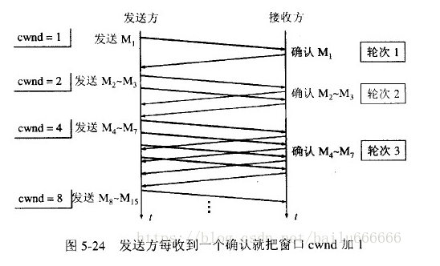
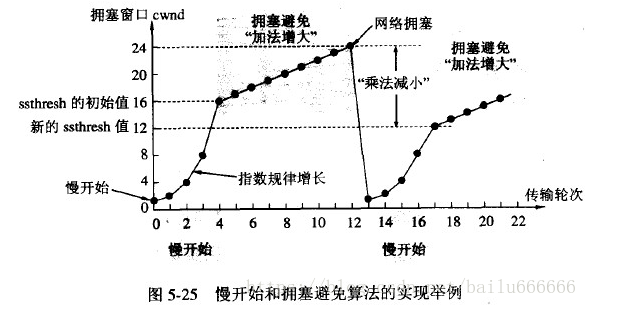
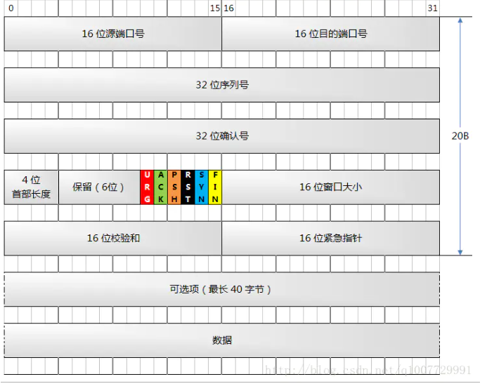
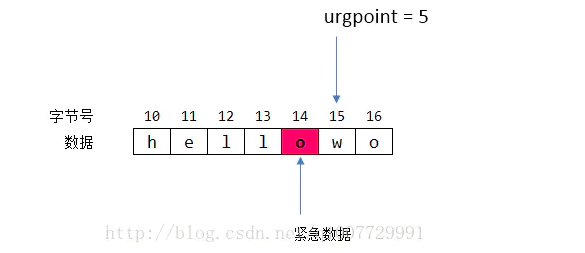

## 拥塞窗口

 发送方维持一个拥塞窗口 cwnd ( congestion window )的状态变量。拥塞窗口的大小取决于网络的拥塞程度，并且动态地在变化。发送方让自己的发送窗口等于拥塞。

## 慢开始算法

在刚刚开始发送报文段时，先把拥塞窗口 cwnd 设置为1个最大报文段MSS的数值，而后每收到一个对新的报文段的确认，就把拥塞窗口增加1个MSS的数值，这样拥塞窗口cwnd的值就随着传输轮次（一个轮次即发送完一个cwnd的MSS）呈指数级增长，事实上，慢启动的速度一点也不慢，只是它的起点比较低一点而已。用这样的方法逐步增大发送方的拥塞窗口 cwnd ，可以使分组注入到网络的速率更加合理。

一个传输轮次所经历的时间其实就是往返时间RTT，不过“传输轮次”更加强调：把拥塞窗口cwnd所允许发送的报文段都连续发送出去，并收到了对已发送的最后一个字节的确认。

## 慢开始门限ssthresh

为了防止拥塞窗口cwnd增长过大引起网络拥塞，还需要设置一个慢开始门限ssthresh状态变量（如何设置ssthresh）。慢开始门限ssthresh的用法如下：

- 当 cwnd < ssthresh 时，使用上述的慢开始算法。
-  当 cwnd > ssthresh 时，停止使用慢开始算法而改用拥塞避免算法。
-  当 cwnd = ssthresh 时，既可使用慢开始算法，也可使用拥塞控制避免算法。

## 拥塞避免算法

 当cwnd >= ssthresh时，就会进入“拥塞避免算法”，让拥塞窗口cwnd缓慢地增大，每收到1个ACK拥塞窗口cwnd = cwnd + 1/cwnd，即每经过一个传输轮次就把发送方的拥塞窗口cwnd加1。这样拥塞窗口cwnd按线性规律缓慢增长，比慢开始算法的拥塞窗口增长速率缓慢得多。

## 网络拥塞

无论在慢开始阶段还是在拥塞避免阶段，只要发送方判断网络出现拥塞（**超时计时器RTO时限已到但还没有收到确认**），就要把**慢开始门限ssthresh=cwnd/2（>=2）**，然后把**拥塞窗口cwnd=1**，执行慢开始算法。这样做的目的就是要迅速减少主机发送到网络中的分组数，使得发生拥塞的路由器有足够时间把队列中积压的分组处理完毕。

如下图，用具体数值说明了上述拥塞控制的过程。现在发送窗口的大小和拥塞窗口一样大。

1. 当TCP连接进行初始化时，把拥塞窗口cwnd置为1MSS，慢开始门限的初始值设置为16个MSS，即 ssthresh = 16 。
2. 在执行慢开始算法时，拥塞窗口 cwnd 的初始值为1。以后发送方每收到一个对新报文段的确认ACK，就把拥塞窗口cwnd加1，则每个传输轮次拥塞窗口cwnd翻倍，因此在慢开始阶段拥塞窗口cwnd 随着传输轮次按指数规律增长。
3.  当拥塞窗口cwnd增长到慢开始门限值ssthresh时（即当cwnd=16时），就改为执行拥塞控制算法，每个传输轮次拥塞窗口cwnd加1，因此在拥塞控制阶段拥塞窗口cwnd 随着传输轮次按线性规律增长。
4. 假定拥塞窗口的数值增长到24时，**超时计时器RTO时限已到但还没有收到确认**，则认为网络出现超时（这很可能就是网络发生拥塞了）。更新后的ssthresh值变为ssthresh/2=12，拥塞窗口cwnd=1，然后回到第2)步继续运行

强调：“拥塞避免”并非指完全能够避免了拥塞。利用以上的措施要完全避免网络拥塞还是不可能的。“拥塞避免”是说在拥塞避免阶段将拥塞窗口控制为按线性规律增长，**使网络比较不容易出现拥塞。**

## 带宽时延乘积

带宽时延乘积=带宽（位/秒）*rtt（秒），带宽时延乘积单位为位，表示在任何特定时间该网络线路上的已发送但尚未确认的数据的最大位数。

个人的理解  

这个宽带延时乘机，就是一个rtt 线路(管道的容量)上能发送多少报文，这些报文都是没有收到ack的，如果这个数必须小于接收方的窗口的大小65535，
rtt时延增加，和宽带增加都会，增加管道容量

## TCP-带外数据（紧急数据）

TCP的紧急数据已经是废弃的功能了。不建议新的应用程序使用，只为旧程序兼容而存在。

当你再次看到图 1 时，相信你已经无比的亲切，再观察下面彩色的 6 个标志位，有 5 个你已经熟知了，还剩下最后一个 URG，对，就是图 1 中那个鲜红的，醒目的那个位置。

除此之外，还有一个字段—— **16 位紧急指针**，它正是配合 URG 标志位一起使用的，言外之意就是这个字段只有在 URG 被置位时才有意义。因为只有一个紧急指针，这也意味着它只能标识一个字节的数据。这个指针指向了紧急数据最后一个字节的下一个字节。

`紧急数据字节号(urgSeq)=TCP报文序号(seq)+紧急指针(urgpoint)−1`

比如图中的例子，如果 seq = 10, urgpoint = 5, 那么字节序号 urgSeq = 10 + 5 -1 = 14.
 知道了字节号后，就可以计算紧急数据字位于所有传输数据中的第几个字节了，如果从第 0 个字节开始算起，那么紧急数据就是第 urgSeq - ISN - 1 个字节（还记得 ISN 吗，它表示初始序列号），减 1 表示不包括第一个 SYN 段，因为一个 SYN 段会消耗一个字节号。

比如图中的例子，如果 seq = 10, urgpoint = 5, 那么字节序号 urgSeq = 10 + 5 -1 = 14.
 知道了字节号后，就可以计算紧急数据字位于所有传输数据中的第几个字节了，如果从第 0 个字节开始算起，那么紧急数据就是第 urgSeq - ISN - 1 个字节（还记得 ISN 吗，它表示初始序列号），减 1 表示不包括第一个 SYN 段，因为一个 SYN 段会消耗一个字节号。

## 紧急数据的作用

紧急标志可以用来通知对端：**我放了一个紧急数据在数据流中，你看着办吧！**这个特性往往可以来达到通知的目的。
 **一旦 TCP 知道了你要发送紧急数据，那么在接下来的数据发送中，TCP 会将所有的 TCP 报文段中的 URG 标志置位，哪怕该报文段中不包含紧急数据，这个行为会持续到紧急数据被发送出去为止。也就是接下来发送的TCP报文的URG都被置为1，直到紧急数据被发送出去**
 TCP协议没有真正意义上的带外数据.为了发送重要协议,[TCP](https://link.jianshu.com?t=http%3A%2F%2Fwww.hudong.com%2Fwiki%2FTCP)提供了一种称为紧急模式(urgentmode)的机制.TCP协议在数据段中设置URG位,表示进入紧急模式.接收方可以对紧急模式采取特殊的处理.很容易看出来,这种方式数据不容易被阻塞,可以通过在我们的服务器端程序里面捕捉SIGURG信号来及时接受数据或者使用带OOB标志的recv函数来接受。
 也 许我们已经意识到了，有时数据会以一定的方式变得紧急。一个流套接口会有一个大量的数据队列等待发送到网络。在远程端点，也会有大量已接收的，却还没有被 程序读取的数据。如果发送客户端程序由于一些原因需要取消已经写入服务器的请求，那么他就需要向服务器紧急发送一个标识取消的请求。如果向远程服务器发送 取消请求失败，那么就会无谓的浪费服务器的资源。
 **使用带外数据的实际程序例子就是telnet,rlogin,ftp命令。前两个程序会将中止字符作为紧急数据发送到远程端。这会允许远程端冲洗所有未处理 的输入，并且丢弃所有未发送的终端输出。这会快速中断一个向我们屏幕发送大量数据的运行进程。ftp命令使用带外数据来中断一个文件的传输。**