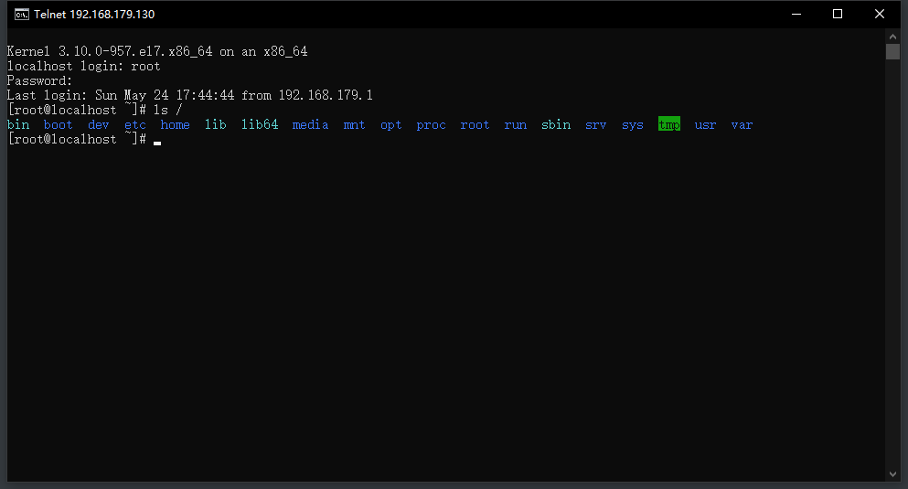
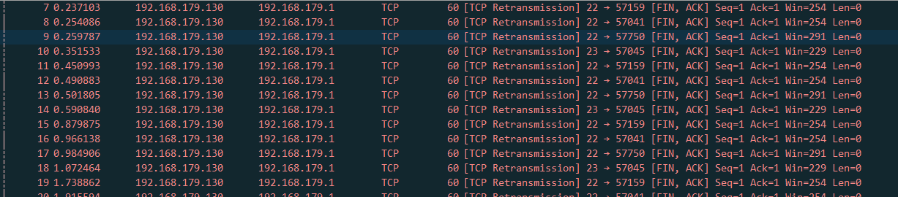
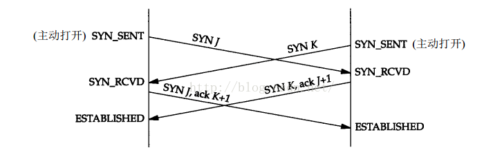
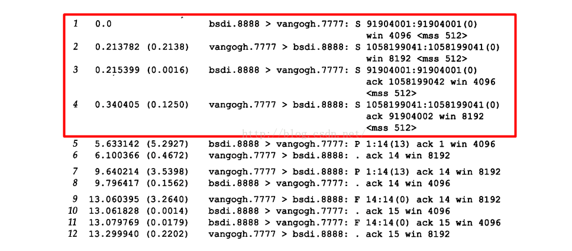
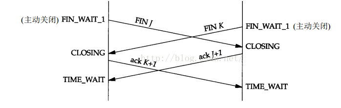

### TCP半打开连接

如果一方已经关闭或者异常终止连接而另外一方却还不知道，这样的连接就称为半打开连接（Half open connection）。处于半打开的连接，如果双方不进行数据通信，是发现不了问题的，只有在通信是才真正的察觉到这个连接已经处于半打开状态，如果双方不传输数据的话，仍处于连接状态的一方就不会检测另外一方已经出现异常

半打开连接的一个常见的原因是客户端或者服务器突然掉电而不是正常的结束应用程序后再关机，这样即使重新启动后，原来的连接信息已经消失了，对端仍然保持半打开状态，如果需要发数据的话，这边收到之后 其实发现这个连接并不存在了，就会回复RST包告知，这个时候就需要重新建立连接了！

接下来使用SSH协议复制一下这个场景：

- telnet 链接centos服务器 192.168.179.130 23
-  建立连接成功，可以在client进行linux操作

- 需要模拟服务器出现异常，先关掉网卡，然后关机（关掉网卡，为了避免关机时服务器主动退出发送FIN包）

  - 我这边复现不了，管理网卡客户端这边就立马监听到断开了；直接关机的话就发送 FIN包了

    

- 重新打开服务器
- 操作客户端，发现已经出现了异常，无法通信，并提示重新连接， 这个时候实际上客户端发送的包被服务器给RST了，因为之前的连接信息已经丢失了
-  重新连接之后可以正常的进行通信
- 服务器重新启动，之前的连接信息都已经丢失，所以它将复位所有信息，因此它不知道数据报文段提到的连接，**处理原则就是接收方以复位做应答**

### 同时打开

两个应用程序同时彼此执行主动打开的情况，2端的端口需要一致，这就需要双方都熟知端口，这种情况发生的概率很小 ，这里简单的介绍一下

场景：

- PC1的应用程序使用端口7777 与PC2的端口8888  执行主动打开

- PC2的应用程序使用端口8888 与PC1的端口7777 执行主动打开

- SYN包同时打开对端，这种情况即为同时打开

  

  **TCP中，对于同时打开它仅建立一条连接而不是两条连接**，状态变迁图如下：同时发送SYN包，然后收到进行确认直接进入ESTABLISHED状态，可以看到同时打开需要连接建立需要4个报文段，比三次握手多一次！

  

这种情况复现不了，用书上的一张图

​	

第 1,2行 执行2个 SYN ,第3,4行执行了2个 SYN,ACK

### 同时关闭

有同时打开，理所应当的也有同时关闭的场景，TCP协议也允许同时关闭。状态变化可以看到下图了，同时发送FIN包，两端同时执行主动关闭，进入FIN_WAIT_1的状态，从FIN_WAIT_1状态收到FIN包的时候进入CLOSING状态，然后回复ACK，进入TIME_WAIT状态。

