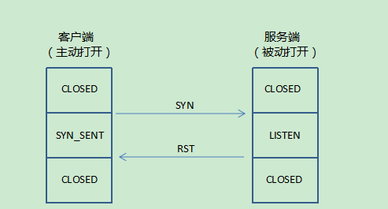
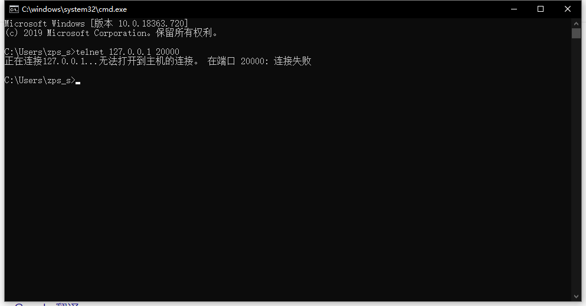
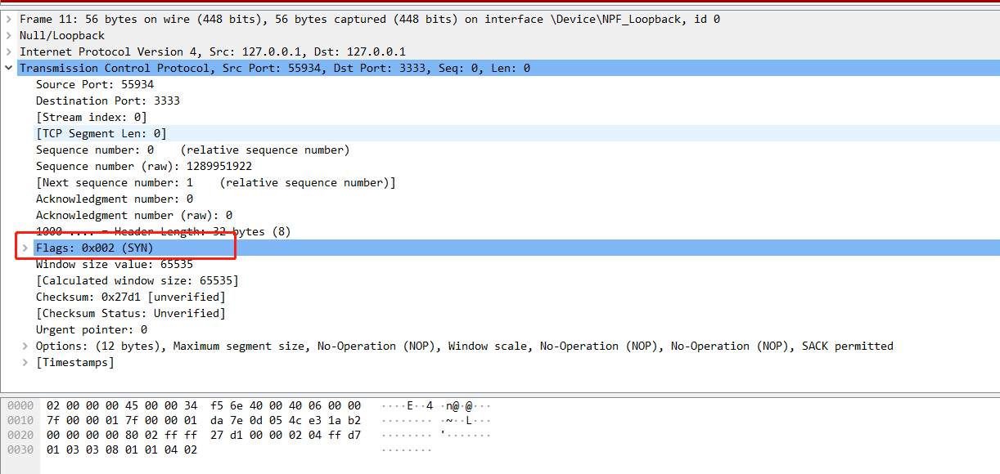
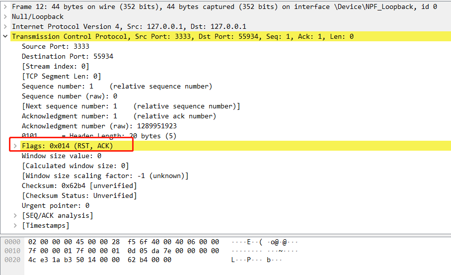
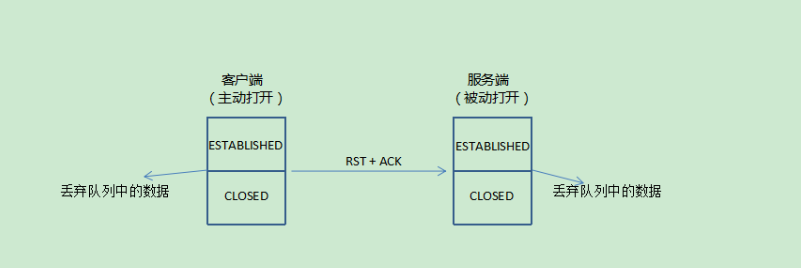

tcp连接异常终止的情况。一般来说，导致这种情况的原因一般有很多种，比如：

- 拒绝连接请求，比如：A想和B建立tcp连接，但是A的连接请求中使用了一个不存在的端口（比如：这个端口超出65535的范围），那么B就可以发送RST报文段拒绝这个请求。

- 异常终止连接，如:A和B的tcp连接出现了异常，然后B希望终止这条异常的连接，于是就可以发送一个RST报文段终止这个连接

- 终止空闲的连接，如A和B之间的tcp连接已经很久没有传输数据了，空闲太长时间，可以发送RST报文段来终止这个连接。

  

  

  这里我们只针对拒绝连接请求和异常终止连接做详细介绍。

### 拒绝连接

拒绝连接一般是由服务器主动发起的，因为客户端发起请求连接携带的目的端口，可能服务器并没有开启LISTEN状态。因此服务器在收到这样的报文段后会发送一个RST报文段，在这个报文里把RST和ACK都置为1，它确认了SYN报文段并同时重置了该tcp连接，然后服务器等待另一个连接。客户端在收到RST+ACK报文段后就会进入CLOSED状态。

telnet 登录一个没有的端口，用wireshark 抓包查看

telnet登录和发送SYN序号

服务端抓包服务器，rst，ack 报文

### 异常终止连接

出现异常终止连接的原因有很多种，可能是进程出现bug了或者由于数据出现了不一致（不想发送数据了），对于这种情况，tcp有可能终止一条连接。也就是说，在这些情况下，就可以发送RST报文段异常终止连接。

客户端由于队列中的数据出现了不一致，发送了RST+ACK报文段异常终止连接，注意：在发送RST+ACK报文段的时候会丢弃掉队列中的所有数据，服务器也会把队列中的所有数据都丢弃掉，并通过一个ICMP差错报告报文通知服务器，然后双方都进入CLOSED状态。

在一些情况下，我们可能想让服务端把数据发送完，然后再关闭tcp连接，而不是马上发送RST报文终止这条连接，那么可以在套接字编程中使用SO_LINGER选项。SO_LINGER选项是用来设置延迟关闭的时间，等待套接字发送缓冲区中的数据发送完成，但是并不保证数据一定会被对方接收，只是等待一段时间后，再正常关闭tcp连接。如果SO_LINGER设置为0，则会清除队列中的所有数据，直接发送RST报文关闭连接

**需要注意的是：对于RST报文段，另一端不需要发送任何响应，因为发送完RST报文后，这条tcp连接就关闭了，也就没有必要确认了**，收到RST的一方将终止该连接，并通知应用层复位连接。