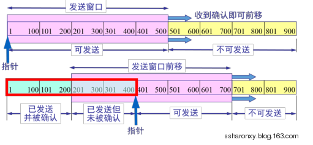
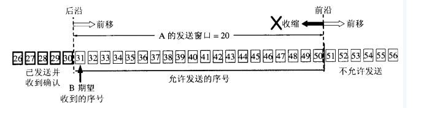
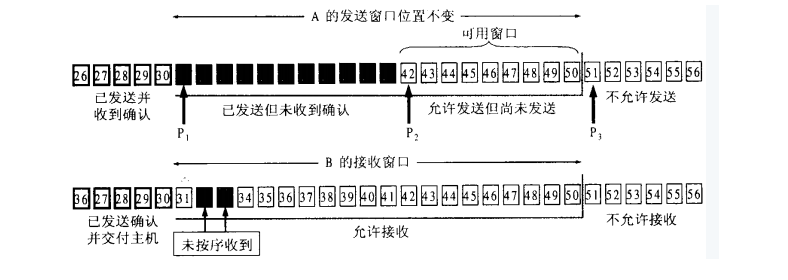
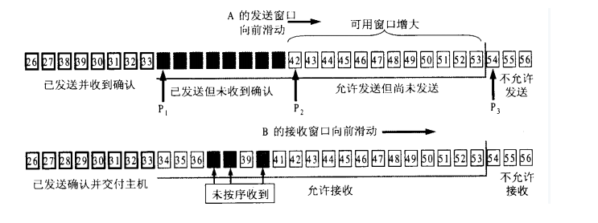
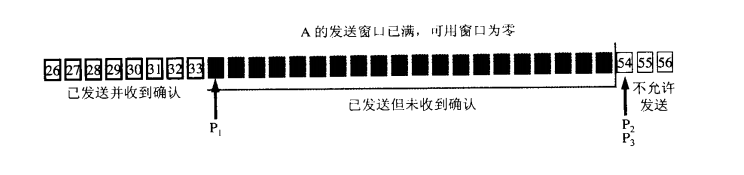
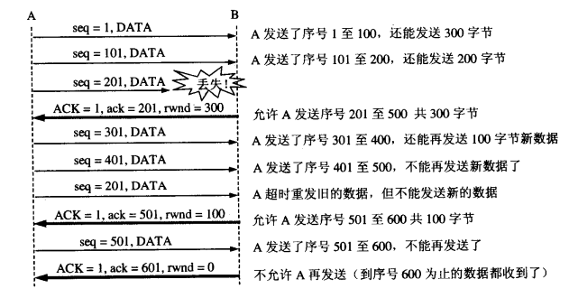

滑动窗口协议（Sliding Window Protocol），属于TCP协议的一种应用，用于网络数据传输时的流量控制，以避免拥塞的发生。该协议允许发送方在停止并等待确认前发送多个数据分组。由于发送方不必每发一个分组就停下来等待确认，因此该协议可以加速数据的传输，提高网络吞吐量

TCP通过滑动窗口的概念来进行流量控制。设想在发送端发送数据的速度很快而接收端接收速度却很慢的情况下，为了保证数据不丢失，显然需要进行流量控制， 协调好通信双方的工作节奏。所谓滑动窗口，可以理解成接收端所能提供的缓冲区大小。TCP利用一个滑动的窗口来告诉发送端对它所发送的数据能提供多大的缓 冲区。由于窗口由16位bit所定义，所以接收端TCP 能最大提供65535个字节的缓冲。由此，可以利用窗口大小和第一个数据的序列号计算出最大可接收的数据序列号。 

滑动窗口本质上是描述接受方的TCP数据报缓冲区大小的数据，发送方根据这个数据来计算自己最多能发送多长的数据。如果发送方收到接受方的窗口大小为0的TCP数据报，那么发送方将停止发送数据，等到接受方发送窗口大小不为0的数据报的到来。 

- 窗口合拢：当窗口从左边向右边靠近的时候，这种现象发生在数据被发送和确认的时候。  
- 窗口张开：当窗口的右边沿向右边移动的时候，这种现象发生在接受端处理了数据以后。  
- 窗口收缩：当窗口的右边沿向左边移动的时候，这种现象不常发生。  
- TCP就是用这个窗口，慢慢的从数据的左边移动到右边，把处于窗口范围内的数据发送出去（但不用发送所有，只是处于窗口内的数据可以发送。）。这就是窗口的意义。窗口的大小是可以通过socket来制定的，4096并不是最理想的窗口大小，而16384则可以使吞吐量大大的增加。

A————C————B

如上图，A与B之间建立TCP连接，滑动窗口实现有两个作用： 

由于对称性，只考虑A端发送窗口和B端接收窗口，有如下两个作用  

- B端来不及处理接收数据（控制不同速率主机间的同步），这时，A通过B端通知的接收窗口而减缓数据的发送。  
- B端来得及处理接收数据，但是在A与B之间某处如C，使得AB之间的整体带宽性能较差，此时，A端根据拥塞处理策略（慢启动，加倍递减和缓慢增加）来更新窗口，以决定数据的发送。  

与固定大小的滑窗协议相比，TCP采用可变大小的滑窗协议是为了取得更好的性能。  

TCP是一个广域网协议，而广域网环境下的路由器和主机，各自有着不同的性能和处理能力，在这种情况下，采用固定窗口大小的滑窗协议会引起性能上的损失。TCP规定窗口的大小是由接收方通告的，通过采取慢启动和拥塞避免算法等机制来使带宽和性能取得最佳。

-  “窗口”对应的是一段可以被发送者发送的字节序列，其连续的范围称之为“窗口”；
- “滑动”则是指这段“允许发送的范围”是可以随着发送的过程而变化的，方式就是按顺序“滑动”。
  - TCP协议的两端分别为发送者A和接收者B，由于是全双工协议，因此A和B应该分别维护着一个独立的发送缓冲区和接收缓冲区，由于对等性（A发B收和B发A收），我们以A发送B接收的情况作为例子；
  - 发送窗口是发送缓存中的一部分，是可以被TCP协议发送的那部分，其实应用层需要发送的所有数据都被放进了发送者的发送缓冲区；
  - 发送窗口中相关的有四个概念：已发送并收到确认的数据（不再发送窗口和发送缓冲区之内）、已发送但未收到确认的数据（位于发送窗口之中）、允许发送但尚未发送的数据以及发送窗口外发送缓冲区内暂时不允许发送的数据
  - 每次成功发送数据之后，发送窗口就会在发送缓冲区中按顺序移动，将 新的数据包含到窗口中准备发送；

TCP建立连接的初始，B会告诉A自己的接收窗口大小，比如为‘20’：字节31-50为发送窗口。

根据B给出窗口值，A构造自己的窗口

A发送11个字节后，发送窗口位置不变，B接收到了乱序的数据分组：

A发了11个字节数据

只有当A成功发送了数据，即发送的数据得到了B的确认之后，才会移动滑动窗口离开已发送的数据；同时B则确认连续的数据分组，对于乱序的分组则先接收下来，避免网络重复传递：

A收到新的确认号，窗口向前滑动

​												

发送窗口内的序号都属于已发送但未被确认

所谓流量控制，主要是接收方传递信息给发送方，使其不要发送数据太快，是一种端到端的控制。主要的方式就是返回的ACK中会包含自己的接收窗口的大小，并且利用大小来控制发送方的数据发送：

​	

​	

这里面涉及到一种情况，如果B已经告诉A自己的缓冲区已满，于是A停止发送数据；等待一段时间后，B的缓冲区出现了富余，于是给A发送报文告诉A我的rwnd大小为400，但是这个报文不幸丢失了，于是就出现A等待B的通知||B等待A发送数据的死锁状态。为了处理这种问题，TCP引入了持续计时器（Persistence timer），当A收到对方的零窗口通知时，就启用该计时器，时间到则发送一个1字节的探测报文，对方会在此时回应自身的接收窗口大小，如果结果仍未0，则重设持续计时器，继续等待。